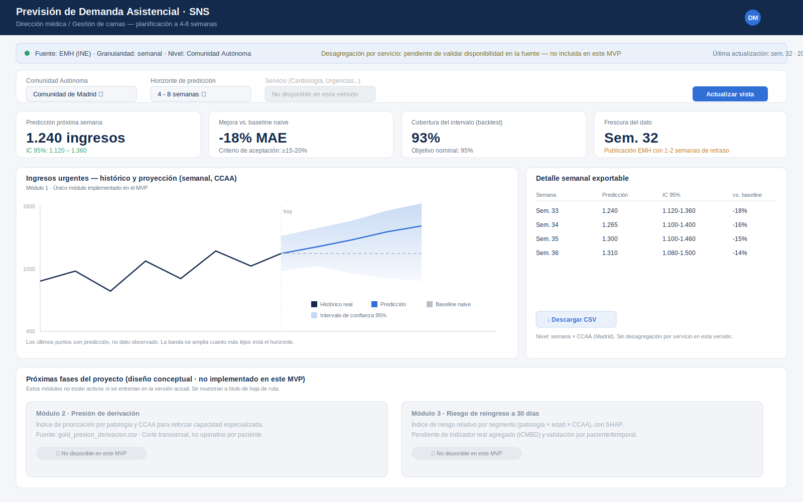

# Entrega 5 - Diseño del frontal y experiencia de usuario del producto

> **Nota de revisión (continuación hacia TFM completo):** este documento amplía el frontal de la versión anterior (centrado solo en demanda) a los tres módulos definidos en las Entregas 3 y 4: predicción de demanda (M1), índice de priorización de derivación (M2) e índice de riesgo de reingreso al alta (M3). Se mantiene el mismo principio de diseño: el sistema es consultivo, nunca prescriptivo, y ningún resultado se presenta sin su margen de incertidumbre o su nivel de agregación explícito.

## 1. Resumen de la solución y del usuario

**Problema que resuelve el proyecto:** los hospitales del SNS gestionan de forma mayoritariamente reactiva tres decisiones relacionadas entre sí: cuánta demanda va a llegar, en qué patologías/zonas conviene reforzar la capacidad de derivación, y en qué perfiles de alta el riesgo de reingreso es más alto. El proyecto convierte la serie histórica real 2014-2023 (EMH, ESCRI, GRD, iCMBD) en tres indicadores accionables para apoyar esas tres decisiones.

**Usuario principal:** dirección médica / gestión de camas de un hospital o área sanitaria (módulos 1 y 2), y responsables de calidad asistencial (módulo 3). Es un perfil no técnico que necesita apoyar decisiones de planificación, no interpretar un modelo estadístico.

**Necesidad, tarea o decisión concreta:**
- M1: decidir con 4-8 semanas de antelación si reforzar la dotación de un servicio antes del pico de temporada.
- M2: decidir en qué patologías/CCAA priorizar acuerdos de derivación o refuerzo de capacidad especializada de cara a la temporada.
- M3: decidir en qué segmentos (patología × edad × CCAA) reforzar protocolos de alta o seguimiento post-alta.

**Tipo de producto:** dashboard analítico de tres bloques predictivos/explicativos sobre una base de EDA común. No es un clasificador ni un recomendador de acciones sobre un paciente individual: en los tres módulos expone un índice o proyección con su margen de incertidumbre y deja la decisión en manos del gestor.

**Resultado o acción principal:** por módulo, una vista con el indicador principal, su margen de confianza o de agregación, comparación contra un baseline histórico, y una tabla exportable para trasladar a la planificación de turnos, red de derivación o revisión de protocolos, según el módulo.

## 2. Imagen mockup del frontal

La imagen principal muestra la pestaña de **Demanda (M1)**, seleccionada por defecto al abrir el panel, con la barra de navegación superior que da acceso a las otras tres pestañas (EDA histórico, Derivación M2, Reingreso M3). De arriba abajo: cabecera con el área sanitaria activa; barra de pestañas; aviso permanente sobre el desfase de la fuente de datos; filtros de CCAA, servicio y horizonte; gráfico de histórico y proyección con banda de confianza; indicadores clave (predicción puntual, mejora frente al baseline, confianza del modelo) y panel de estacionalidad; tabla exportable de las próximas semanas con estado de cobertura por fila; y las acciones de exportación. Las pestañas de Derivación y Reingreso reutilizan esta misma estructura de cabecera, aviso y filtros, sustituyendo el gráfico y la tabla centrales por el mapa/mapa de calor descrito en el apartado 3.2.

## 3. Justificación del diseño

### 3.1. Utilidad y valor de la solución

El frontal resuelve tres tareas concretas de planificación, no una alerta operativa: M1 anticipa volumen, M2 anticipa dónde reforzar la red de derivación, M3 anticipa dónde reforzar protocolos de alta. Los tres módulos comparten el mismo principio de comunicación: mostrar siempre el resultado junto a su nivel de agregación y su comparación con un baseline histórico, para que el gestor entienda qué tan fiable es el número antes de actuar sobre él.

En M1 se muestra siempre, sin necesidad de profundizar, el número previsto, el rango de incertidumbre y la mejora del modelo frente a un baseline naive: los tres datos mínimos para decidir con criterio. En M2 y M3 se muestra siempre el score de 0 a 100 del segmento junto con sus 2-3 factores explicativos principales, en lenguaje no técnico (p. ej. "alta tasa de traslado + estancia por encima de lo esperado según GRD"), que es el equivalente de esos tres datos mínimos para una decisión de priorización en vez de una decisión de dotación.

Se ha decidido **no mostrar** en la pantalla principal de ningún módulo: los parámetros internos del modelo (órdenes SARIMA, coeficientes de la regresión de M2/M3), el detalle del proceso de entrenamiento, ni los tests estadísticos de validación (Dickey-Fuller, ACF/PACF, validación cruzada leave-one-year-out). Esa información es imprescindible para el equipo del proyecto pero no aporta nada a la decisión del gestor; queda disponible en un enlace de detalle técnico.

El resultado analítico se convierte en acción mediante la tabla exportable en CSV (M1) y el ranking priorizado exportable (M2, M3), que el gestor puede trasladar directamente a su herramienta de planificación de turnos, a una reunión de planificación de red o a una revisión de protocolos de calidad asistencial, sin tener que volver a teclear los números del dashboard.

### 3.2. Flujo de usuario

1. **Punto de entrada:** el gestor accede al dashboard y ve de inmediato el aviso de frescura de datos (última EMH/ESCRI/iCMBD disponible, fecha de generación del panel), en la pestaña de Demanda (M1) por defecto. Esto fija expectativas antes de mirar ningún número: el sistema es de planificación estructural, no una alerta en tiempo real.
2. **Entradas o selecciones:** el gestor elige la pestaña de módulo (Demanda / Derivación / Reingreso) y, dentro de ella, CCAA y, según el módulo, servicio y horizonte (M1), patología (M2), o patología y grupo de edad (M3). No hay más parámetros que introducir: el sistema no pide datos clínicos ni operativos al usuario.
3. **Procesamiento:** en segundo plano se ejecuta el modelo correspondiente -forecasting SARIMA/Prophet sobre `gold_demanda_asistencial.csv` (M1), o regresión explicativa sobre `gold_presion_derivacion.csv` (M2) / `gold_riesgo_reingreso.csv` (M3)- sin que el gestor necesite saber qué modelo es ni cómo se entrenó.
4. **Resultado:** en M1, el gráfico principal, los indicadores clave y la tabla de próximas semanas. En M2 y M3, un mapa de España o mapa de calor coloreado por score, con los factores explicativos visibles al seleccionar una celda. El gestor sabe si confiar en el resultado mirando siempre la misma señal en los tres módulos: el margen de incertidumbre o el nivel mínimo de datos que sostiene la celda (ancho de banda en M1, aviso de "cobertura insuficiente" en M2/M3).
5. **Acción:** exportar la tabla o el ranking priorizado (CSV) para repartir turnos y dotación (M1), llevarlo a una reunión de planificación de red (M2) o de calidad asistencial (M3); o descargar el informe (PDF) para una reunión de dirección. El dashboard no ejecuta ninguna acción operativa por sí mismo en ningún módulo: es una herramienta de apoyo a la decisión.
6. **Excepciones:** cuando una combinación tiene volumen histórico insuficiente (p. ej. Illes Balears/Pediatría en M1, o una patología poco frecuente en una CCAA pequeña en M2/M3), la fila o celda correspondiente se marca como "cobertura baja/insuficiente" y se oculta el intervalo o el score, en lugar de mostrar un número poco fiable sin advertencia. Si un módulo no llega a su umbral de aceptación (mejora frente al baseline en M1; capacidad explicativa frente a la media histórica en M2/M3, criterios definidos en la Entrega 4), el panel se repliega a mostrar solo el patrón histórico descriptivo para esa combinación, sin componente predictivo/explicativo, en vez de forzar un resultado poco fiable.

### 3.3. Experiencia de usuario

**Jerarquía visual:** en M1, lo primero que capta la atención es el gráfico de histórico y proyección, porque responde a la pregunta central ("¿qué va a pasar y con qué margen de error?"). En M2 y M3, el mapa/mapa de calor cumple ese mismo papel principal ("¿dónde está el problema?"). Los indicadores clave y los factores explicativos quedan en segundo plano visual, siempre visibles sin hacer scroll o al seleccionar una celda.

**Simplicidad:** se ha evitado convertir el dashboard en un panel de control estadístico. No aparecen métricas de ajuste del modelo (AIC, RMSE por parámetro, coeficientes de regresión, residuos) en la pantalla principal de ningún módulo; solo la métrica que el gestor puede interpretar sin formación técnica.

**Legibilidad y consistencia:** una única paleta de estado se repite en las cuatro pestañas — verde para "fiable/dentro de lo esperado", ámbar para "atención/incertidumbre", rojo-ladrillo para "aviso de cobertura o desviación". El mismo código de color se usa en la tabla y tarjetas de M1, y en la escala de score de los mapas de M2/M3, para que el gestor no tenga que reaprender el significado de un color al cambiar de pestaña.

**Contexto y confianza:** ningún resultado se muestra como un número o color aislado. En M1 siempre va acompañado de su intervalo de confianza y de la comparación contra el baseline; en M2 y M3, siempre va acompañado de sus factores explicativos principales y de su nivel de agregación (para dejar explícito que es un índice de segmento, no una evaluación de un paciente concreto).

**Control del usuario:** el gestor puede cambiar de pestaña, CCAA, servicio/patología y horizonte/edad libremente y explorar distintas combinaciones antes de exportar nada; el sistema no toma ninguna decisión de forma autónoma en ningún módulo, solo la presenta para que el gestor la revise y decida.

**Feedback del sistema:** el aviso de frescura de datos, el estado "cobertura baja/insuficiente" y la tarjeta de aviso de cobertura son las formas de feedback explícito comunes a las cuatro pestañas, en lenguaje no técnico.

## 4. Presentación de resultados y explicabilidad

**Resultado principal:** en M1, una predicción puntual de ingresos urgentes por semana, servicio y CCAA, siempre acompañada de su intervalo de confianza al 95%. En M2 y M3, un índice de 0 a 100 por segmento (patología × CCAA en M2; patología × edad × CCAA en M3), siempre acompañado de sus 2-3 factores explicativos principales.

**Información adicional para interpretarlo:** en M1, la serie histórica reciente superpuesta a la proyección, el patrón de estacionalidad de referencia, y la comparación explícita de error frente al baseline naive. En M2 y M3, el volumen de altas que sostiene el segmento (para juzgar la fiabilidad del score) y la comparación implícita con la media histórica de la patología, usada como baseline en la validación (Entrega 4).

**Cómo se evita presentar la estimación como una certeza:** en M1, el intervalo de confianza se dibuja siempre junto al valor puntual; cuando la cobertura es insuficiente, se retira el intervalo y se marca el estado. En M2 y M3, cada score va acompañado de un aviso explícito y permanente: *"Este índice prioriza patologías/segmentos para planificación, no evalúa a un paciente individual"*, y las celdas con volumen insuficiente no muestran score.

**Información técnica reservada a vista de detalle:** los tests de estacionariedad, el orden del modelo SARIMA y el desglose de error por horizonte (M1); los coeficientes/importancias completos de la regresión y el detalle de la validación cruzada leave-one-year-out (M2, M3). Ninguno aparece en la pantalla principal; quedan en un enlace "ver detalle" pensado para el propio equipo del proyecto o un perfil analítico, no para el gestor.

**IA generativa:** no se utiliza IA generativa en ningún módulo del MVP. Los tres se apoyan exclusivamente en resultados controlados del modelo correspondiente (predicción e intervalo en M1; score y factores explicativos en M2/M3); no hay narrativa generada automáticamente que pueda inventar causas o descontextualizar la incertidumbre del resultado.

## 5. Alcance del MVP

**Se implementará y será funcional:** el bloque de EDA común; el bloque de forecasting M1 (SARIMA/Prophet sobre `gold_demanda_asistencial.csv`) con su gráfico, indicadores y tabla exportable; los bloques M2 y M3 (regresión explicativa sobre `gold_presion_derivacion.csv` y `gold_riesgo_reingreso.csv`) con su mapa/mapa de calor, factores explicativos y tabla exportable; los filtros de CCAA/servicio/horizonte (M1) y CCAA/patología/edad (M2, M3); y la exportación de tablas en CSV en las tres pestañas.

**Será únicamente representación visual en el mockup, sin implementación real:** la descarga de informe en PDF (funcionalidad deseable, no crítica) y el enlace "ver detalle" por fila/celda hacia la vista técnica ampliada de cada módulo.

**Tecnología prevista:** Streamlit o Dash como framework de frontal, con Plotly para los gráficos interactivos de M1 (histórico, proyección, banda de confianza, estacionalidad) y para los mapas coropléticos por CCAA y mapas de calor de M2 y M3. No se prevé backend ni base de datos propia: el dashboard lee directamente los tres CSV de la capa `gold` generados por el pipeline de las Entregas 3/4, y recalcula al publicarse cada nueva edición de las fuentes.
